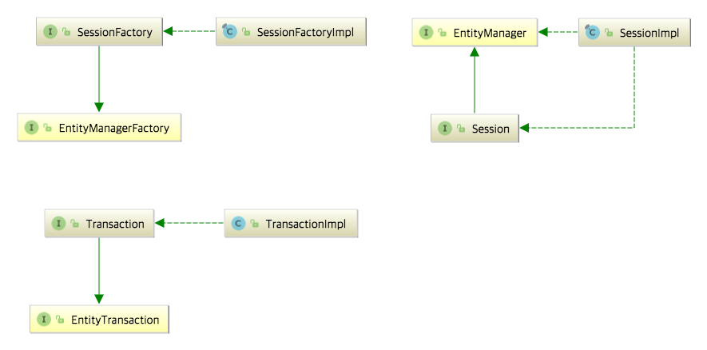
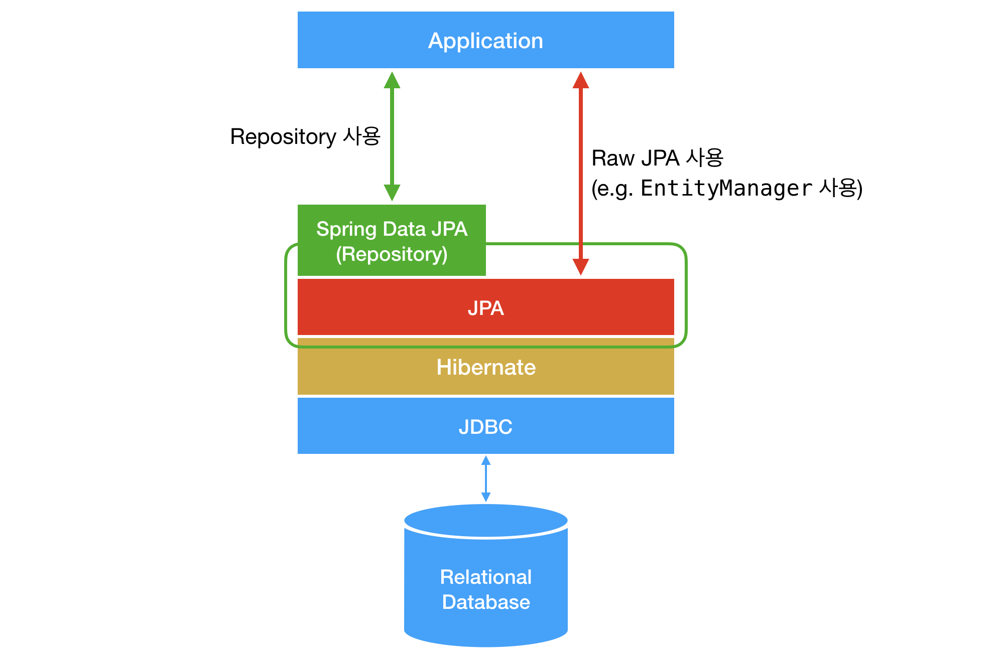

#JPA 개요

### 종류 : Hibernate, JPA, Spring Data JPA(Repository)
 

#### JPA는 기술명세이다.
- JPA(Java Persistence API): 자바 어플리케이션에서 관계형 데이터 베이스를 사용하는 방식을 정의한 인터페이스.
  라이브러리가 아니다.
- JPA는 단순한 명세이기 때문에 구현이 없다.
- JPA를 정의한 패키지는 javax.persistence 패키지, interface, enum, Exception, 각종 Annotation으로 이뤄져 있다.
- EntityManager를 통해 entity CRUD를 구현한다.
     

#### Hibernate는 JPA 의 구현체이다.
- javax.persistence.EntityManager와 같은 인터페이스를 직접 구현한 라이브러리
- JPA와 Hibernate 는 마치 자바의 interface와 해당 interface를 구현한 class와 같은 관계이다.
  

- EntityManagerFactory, EntityManager, EntityTransaction을 Hibernate에서 각각 SessionFactory, Session, Transaction으로 상속받고 각각 Impl로 구현
- 다른 JPA 구현체는 EclipseLink, DataNucleus 등이 있다.
- Hibernate는 성숙한 라이브러리?
     
#### Spring Data JPA는 JPA를 쓰기 편하게 만들어놓은 모듈이다.
- Repository는 Spring Data JPA의 핵심이다.
- Spring에서 제공하는 모듈 중 하나로 개발자가 JPA를 더 쉽고 편하게 사용할 수 있도록 도와준다.
- JPA를 한 단계 추상화시킨 Repository라는 인터페이스를 제공함으로써 이뤄진다.
- 인터페이스에 정해진 규칙대로 메소드를 입력하면, Spring이 알아서 해당 메소드 이름에 적합한 쿼리를 날리는 구현체를 만들어서 Bean으로 등록해준다.
- JPA를 추상화했다는 말은 Spring Data JPA에서 Repository 의 구현에서 JPA를 사용하고 있다는 것.
- SimpleJpaRepository의 고트를 보면 내부적으로 EntityManager를 사용하고 있다.

   내일부터 계속 공부할 것 :
  @Transactional, 연관관계 매핑, JPQL 등