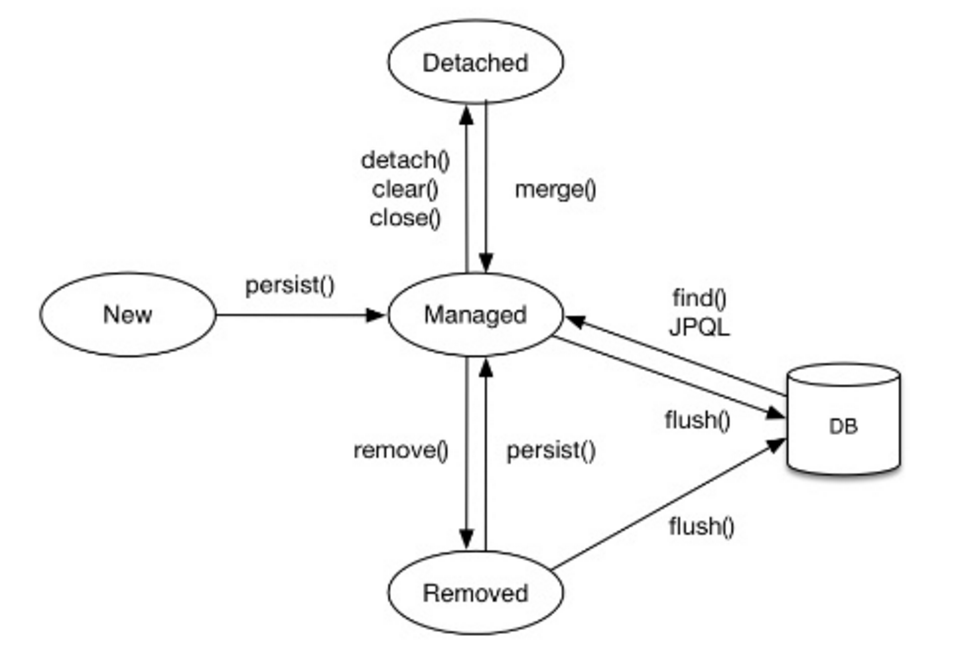

CRUD 정리 : java Collection에 데이터를 넣었다 뺐다 하는 것처럼 만듦
 - 저장 : jpa.persist(member)
 - 조회 : Member member = jpa.find(memberId)
 - 수정 : member.setName("변경할 이름")
 - 삭제 : jpa.remove(member)

## 연관관계 사용
1. 저장
 : 모든 엔티티는 영속 상태여야 한다.
2. 조회 : 
- 객체 그래프 탐색( 객체 연관관계를 사용한 조회)
- 객체 지향 쿼리를 사용한다.(JPQL:  SQL 을 추상화한 객체지향쿼리 언어를 제공, 문법이 SQL과 유사하다.) 차이점은 엔티티 객체를 대상으로 쿼리하느냐, 데이터 베이스 테이블을 대상으로 쿼리하느냐이다. 

## 엔티티 매니저 팩토리 vs 엔티티매니저
- EntityManagerFactory : 다수의 엔티티 매니저 생성가능, 여러 스레드가 동시에 접근해도 안전하므로 서로 다른 스레드 간에 공유해도 된다.
- EntityManger : 여러 스레드가 동시에 접근하면 동시성 문제가 발생하므로 스레드간에 공유가 절대 안된다.
  connection을 필요 시점인 트랜잭션을 시작할때 커넥션을 획득한다.

- JPA 구현체들은  EntityManagerFactory를 생성할때 커넥션 풀도 만드는데 이건 J2SE 환경에서 사용하는 방법이다.
- JPA를 J2EE환경에서 사용하면 해당 컨테이너가 제공하는 데이터 소스를 사용한다.

## 엔티티의  생명주기
- 비영속(new, transient) : 영속성 컨텍스트와 전혀 관계가 없는 상태
- 영속(managed) : 영속성 컨텍스트에 저장된 상태
- 준영속(detached) : 영속성 컨텍스트에 저장되었다가 분리된 상태
- 삭제(removed) : 삭제된 상태
  

## JPA의 성능 최적화 기능
: 중간 계층이 있는 경우 아래의 방법으로 성능을 개선할 수 있는 기능이 존재한다.
 - 모아서 쓰는 버퍼링 기능
 - 읽을 때 쓰는 캐싱 기능

1) 1차 캐시와 동일성 보장 :캐싱 기능 : 1차 캐시에 있는 엔티티를 조회한다.( em.find() 호출)
   1) 같은 트랜잭션 안에서는 같은 엔티티를 반환 : 약간의 조회 성능을 향상시키는데 크게 도움되지 않는다.
   ** 결과적으로 SQL 을 한번만 실행한다.
   2) DB Isolation Level 이 Read Commit 이어도 애플리케이션에서 Repeatable Read 보장한다.
2) 트랜잭션을 지원하는 쓰기  지연 : 버퍼링 기능
- INSERT
    1) JDBC Batch SQL 기능을 사용해서 한번에 SQL을 전송한다.
    - JDBC Batch를 사용하면 코드가 굉장히 지저분해지고
    - 지연로딩전략(Lazy Loading) 옵션을 사용한다.
- UPDATE
    1) UPDATE, DELETE 로 인한 로우(ROW)락 시간 최소화
    2) 트랜잭션  커밋시 UPDATE, DELETE SQL 실행하고 바로 커밋한다.
3) 지연 로딩
    - 객체가 실제로 사용될 때 로딩하는 전략

4) 즉시 로딩
 - JOIN SQL로 한번에 연관된 객체까지 미리 조회하는 전략
 - join 을 통해 항상 연관된 모든 객체를 같이 가져온다.

## 업데이트 기본 전략
- JPA의 기본 전략은 모든 필드를 업데이트한다.
- 모든 필드를 사용하면 수정쿼리가 항상 같다
- 동일한 쿼리를 보내면 데이터베이스는 이전에 파싱된 쿼리는 재사용한다.

## 필드가 많거나 저장되는 내용이 큰 경우에 하이버네이트 확장 기능을 사용한다.
@Entity  
@org.hibernate.annotation.DynamicUpdate 
@Table(name ="Member")  
public class Member {...}

수정된 데이터만 사용해서 동적으로 UPDATE SQL을 생성

## 엔티티 조회    JPQL
- em.createQuery(JPQL, 반환타입) 메소드 실행
- 쿼리 객체 생성한 후, 쿼리 객체의 getResultList() 메소드를 호출하면 된다.

## 엔티티 삭제
- 삭제할 엔티티 조회
- em.remove(member)
- 바로 삭제가 아닌 삭제 쿼리를 쓰기 지연 SQL 저장소에 등록한다.
- em.remove(member)를 호출하는 순간 영속성 컨텍스트에서 제거된다.

## 트랜잭션
- 트랜잭션을 커밋하면 엔티티 매니저느 우선 영속성 컨텍스트를 플러시한다.
- 플러시는 영속성 컨텍스트의 변경 내용을 데이터 베이스에 동기화하는 작업
- 등록, 수정, 삭제한 엔티티에 반영한다.
- 쓰기 지연 SQL 저장소에 모인 쿼리를 데이터 베이스에 보낸 후 동기화한 다음 실제 DB 트랜잭션을 커밋한다.

## 더티 체킹 (변경 감지)
- 엔티티를 영속성 컨텍스트에 보관할때 최초 상태를 복사해서 저장해둔다 : 스냅샷
- 플러시 시저에 스냅샷과 엔티티를 비교해 변경된 엔티티를 찾는다
- 순서
  1. 트랜잭션 커밋은 엔티티 매니저 내부에서 먼저 flush()가 호출
  2. 엔티티와 스냅샷을 비교해 변경된 엔티티를 찾기
  3. 변경된 엔티티가 있으면 수정 쿼리를 생성해서 쓰기 지연 SQL 저장소에 보낸ㄷ
  4. 쓰기 지연 저장소의 SQL을 데이터 베이스에 보낸다.
  5. 데이터 베이스 트랜잭션을 커밋한다.

더티체킹은 영속성 컨텍스트가 관리하는 영속 상태의 엔티티에만 적용된다.

요약집 홈페이지 : https://ultrakain.gitbooks.io/jpa/content/
